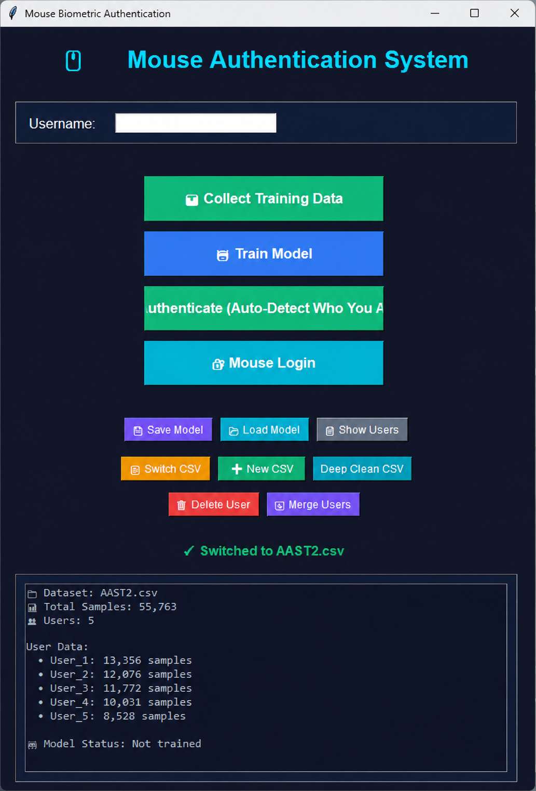

# Mouse Dynamics Authentication System

<p align="center">
  
</p>

<p align="center">
Behavioral biometric authentication using mouse movement dynamics and machine learning.
</p>

---

## Overview

This project explores behavioral biometrics by identifying users through their unique mouse movement patterns.  
The system analyzes session-based mouse activity, extracts behavioral features, and applies machine learning models for authentication and anomaly detection.

---

## Features

- Behavioral biometric authentication
- Session-based mouse activity analysis
- Machine learning authentication pipeline
- Confidence and anomaly detection
- GUI application for training and testing
- Chunk-based session validation
- Anti-cheating integrity validation

---

## Application Preview

<p align="center">
  
</p>

---

## Project Structure

```text
src/
  ├── MouseAuth.py
  ├── shared_session_builder.py
  └── train_improved.py

scripts/
  ├── run.bat
  ├── run_gui.bat
  └── test_gui_ready.bat

assets/
  ├── banner.png
  └── gui-preview.png

data/
models/
logs/
```

---

## Installation

### Requirements

- Python 3.7+
- Windows / Linux / macOS

### Install Dependencies

```bash
pip install -r requirements.txt
```

Or manually:

```bash
pip install pandas numpy scikit-learn scipy xgboost
```

---

## Usage

### Launch GUI

```bash
python src/MouseAuth.py
```

### Windows Shortcut

```bash
scripts\run_gui.bat
```

---

## Authentication Workflow

1. Collect or load mouse session data
2. Build session-based feature vectors
3. Train the authentication model
4. Analyze authentication sessions
5. Review confidence and anomaly results

---

## How It Works

### Behavioral Feature Extraction

The system extracts behavioral metrics from mouse activity including:

- Speed
- Acceleration
- Jerk
- Angle variation
- Curvature
- Path efficiency
- Click timing behavior
- Final movement approach patterns

### Session Analysis

- Mouse samples are grouped into sessions
- Sessions are divided into ordered chunks
- Statistical behavioral features are extracted
- Feature vectors are passed into ML classifiers

### Authentication Logic

The system:
- Learns user-specific behavioral patterns
- Predicts identity using mouse dynamics
- Detects anomalies and inconsistent sessions
- Aggregates chunk-based voting for stability

---

## Technologies Used

- Python
- tkinter
- pandas
- numpy
- scikit-learn
- scipy
- xgboost

---

## Privacy & Security

Biometric datasets, trained models, logs, and local documentation are excluded using `.gitignore` to maintain privacy and repository cleanliness.

---

## Development

### Run Validation Tests

```bash
scripts\test_gui_ready.bat
```

### Verify Python Files

```bash
python -m py_compile src/MouseAuth.py
python -m py_compile src/shared_session_builder.py
python -m py_compile src/train_improved.py
```

---

## Notes

- Uses a shared session-vector pipeline for consistent training and authentication behavior
- Local datasets and trained models are intentionally excluded from GitHub
- Repository structure was reorganized for maintainability and scalability

---

## License

Educational and research use only.
